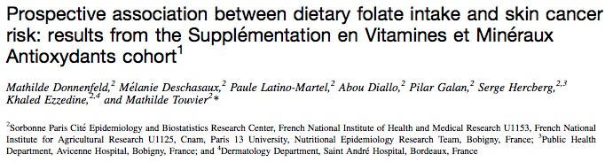
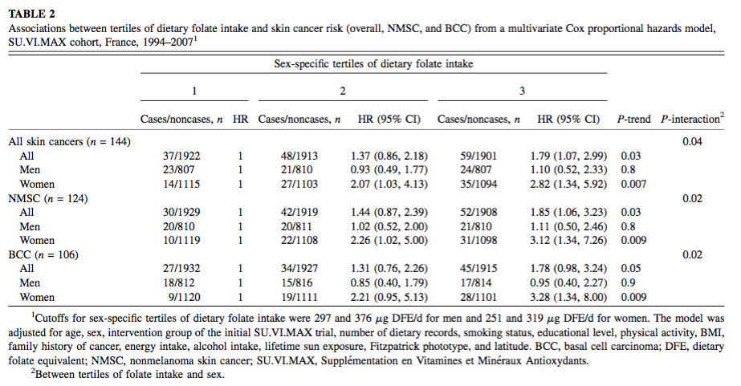
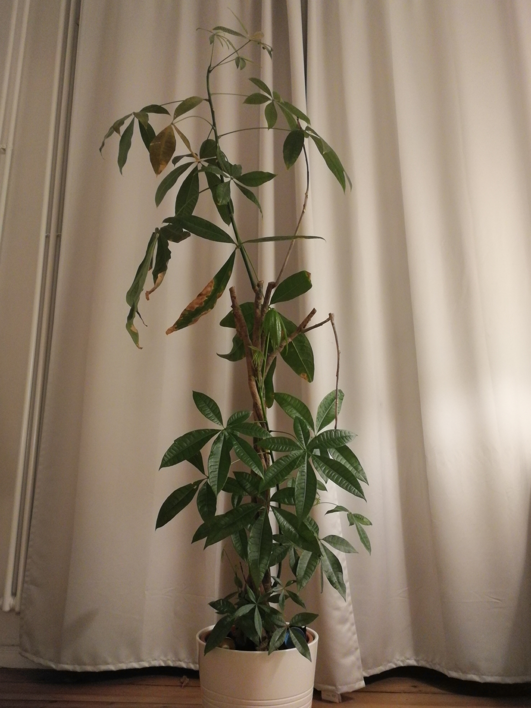

<h1 class="title">Introduction</h1>

<!-- Fonts go here to prevent blank slide -->
<style>
@import url('https://fonts.googleapis.com/css?family=Merriweather|Open+Sans');
</style>
<!-- End fonts -->

```{r setup, include=FALSE}
knitr::opts_chunk$set(
	echo = FALSE
	, message = FALSE
	, warning = FALSE
	# for testing
	# , cache=TRUE
)
```

## A use case

```{r, out.width = "800px"}

```


---

## A use case

```{r, out.width = "800px"}

```

---

## Overview

  What is survival analysis?
  
  What is a Cox model?
  
  The assumption of proportional hazards
  
  Modelling
  
  Takeaways
  
  What about real life?

---

<h1 class="title">What is survival analysis?</h1>


```{r}
# uncomment these if you need to install anything
# install.packages("tidyverse")   # for tidy data
# install.packages("revealjs")    # for building presentation
# install.packages("survival")   # for computing survival analysis
# install.packages("survminer")   # for summarizing visualizing survival analysis
# install.packages("ggfortify")   # for plotting survival curves
```


```{r}
library(survival)       # survival analysis
library(survminer)       # survival analysis
#library(ggfortify)      # plot survival curves
library(tidyverse)      # tidy everything
library(glue)           # for string formatting
theme_set(theme_bw())   # nice theme for plots
source('generate_dataset.R')
```
---

### What is survival analysis?
* Analyzing the survival time of a set of observations
* For this, we need to define:
    * Survival (a 'death' event, e.g. actual death, medical condition declared, churn of customer...)
    * Time to Observation (or TTO, i.e. the time for which we observed the individual before the event occured OR the time after which the individual was censored)

---


### What is survival analysis?

* Hidden idea: all observations will end up 'dying'

* Either we observe this 'death', in which case we measure the time between the beginning of the observation period and the 'death'

* Or we don't, in which case we measure the time between the beginning of the observation period and its end. Those observations are called 'right-censored'.

---

### What is survival analysis?

Another use case: please meet Gertrude.

```{r, out.width = "300px"}

```

Gertrude is a *Pachira Aquatica*

---

### Quick look at our dataset

```{r echo=TRUE}
# df <- yada

head(df, 10)
```


---

### Quick look at our dataset

```{r echo = TRUE}
# Summary of "died" variable
summary(df$died)

# Summary of "days" variable
summary(df$days)
```

---

### Define a survival object

A survival object is composed of the TTO and the event occuring (Y/N)

```{r echo = TRUE}

# Using the Surv function:

df$survival <- Surv(time=df$days, event=df$died)


```

---

### The survivor function

* The survivor (or survival) function gives the probability that an observation will survive beyond a given point in time

* Estimating this function for observations grouped by a given variable allows to estimate the hazard ratio of that variable's levels compared to the reference level

---

### Kaplan-Meier estimate of the survivor function

* A series of time intervals is formed so that at least one tto is contained in the interval

* The start of the interval is the time of this (these) tto(s)

```{r out.width = "600px"}
fit <- survfit(survival ~ 1, data = df)

res.sum <- surv_summary(fit)
head(res.sum, 10)
```

---

### Kaplan-Meier estimate of the survivor function

* The probability of surviving one interval is 

  $$ 1 - \frac{n_{\text{event}}}{n_{\text{at risk}}} $$


* If a censored survival time occurs at the same time as a death, it is considered to occur right after the death event

```{r out.width = "600px"}
head(res.sum, 10)
```

---

### Kaplan-Meier estimate of the survivor function

* The probability of surviving until the end of the n-th interval is the product of all the i-th previous probabilities of surviving, including the n-th

$$
P_{Surv}(\text{Int}K) = P_{Surv}(\text{Int}_1) \cdot P_{Surv}(\text{Int}_2) | (\text{Surv}(\text{Int}_1)) \cdot \dotsc \cdot P_{Surv}(\text{Int}_K) | (\text{Surv}(\text{Int}_{K-1})
$$

```{r out.width = "600px"}
head(res.sum, 10)
```

---

### Plot the survival curve

```{r out.width = "800px"}

ggsurvplot(fit,
          pval = TRUE, conf.int = TRUE,
          risk.table = TRUE, # Add risk table
          risk.table.col = "strata", # Change risk table color by groups
          linetype = "strata", # Change line type by groups
          surv.median.line = "hv" # Specify median survival
)
```

---

### Plot the survival curveS

```{r out.width = "800px"}
fit_proportional <- survfit(survival ~ species, data = df)

ggsurvplot(fit_proportional,
          pval = TRUE, conf.int = TRUE,
          risk.table = TRUE, # Add risk table
          risk.table.col = "strata", # Change risk table color by groups
          linetype = "strata", # Change line type by groups
          surv.median.line = "hv" # Specify median survival
)
```

---

### The log-rank test

```{r}

survdiff(survival ~ species,data=df)

```
---

<h1 class="title">What is a Cox Model?</h1>

---

### What is a Cox model?

* Regression with the hazard function as dependant variable

$$ h_i(t) = h_0(t) \cdot \text{exp}(\beta_1 x_{i1} + \dotsc + \beta_k x_{ik}) $$

* Only the baseline hazard function varies with time

---

<h1 class="title">The assumption of proportional hazards</h1>

---

### The assumption of proportional hazards

```{r, out.width = "500px"}
fit_unproportional <- survfit(survival ~ name, data = df)
ggsurvplot(fit_unproportional,
          pval = TRUE, conf.int = TRUE,
          risk.table = TRUE, # Add risk table
          risk.table.col = "strata", # Change risk table color by groups
          linetype = "strata", # Change line type by groups
          surv.median.line = "hv" # Specify median survival
)
```

---

<h1 class="title">Modelling</h1>

---

### Modelling

In code:

```{r echo=TRUE}

model_full <- coxph(survival ~ name
      + species
, data = df)
```

---  

### Testing assumption of proportional hazards

```{r echo=TRUE}
cox.zph(model_full)
```

---

### Modelling: simplification of the model

We have to take the name variable out. We could also stratify the analysis by name.

```{r echo=TRUE}

model_short <- coxph(survival ~ species
, data = df)

cox.zph(model_short)

```

---

### Modelling: Model output

```{r}
summary(model_short)
```

---

### Modelling: Adjustement

**Those coefficients are not interpretable**

```{r}
summary(model_full)
```

---

### Takeaways

* Survival analysis is a powerful tool for analyzing the association of variables with a hazard function

* Cox model allows to control for adjustment variables

* With great power comes a great assumption

* Congrats to Gertrude (1.5 years and counting!)

---

### What about real life?

In real life, several issues can come across:

* The proportional hazards assumption is a strong one, and hard to meet.

* This is especially true for large datasets

* It can make sense to randomly select a subsample of your population

---


## Further reading
* Donnenfeld et al., *Prospective association between dietary folate intake and skin cancer risk: Results from the Supplémentation en Vitamines et Minéraux Antioxydants cohort*
    * [link](https://www.researchgate.net/publication/279990457_Prospective_association_between_dietary_folate_intake_and_skin_cancer_risk_Results_from_the_Supplementation_en_Vitamines_et_Mineraux_Antioxydants_cohort)
* Walters, *What is a Cox model?*
    * [link](http://www.bandolier.org.uk/painres/download/whatis/COX_MODEL.pdf)
* CRAN, *Plotting with survival package*
    * [link](https://cran.r-project.org/web/packages/ggfortify/vignettes/plot_surv.html)
* LaMorte, *Comparing survival curves: The log-rank test*
    * [link](http://sphweb.bumc.bu.edu/otlt/MPH-Modules/BS/BS704_Survival/BS704_Survival5.html)


---

<h1 class="title">Thanks!</h1>
